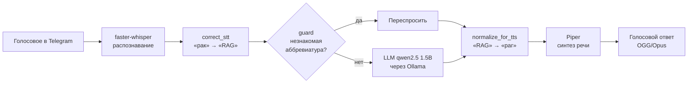

# Voice Assistant Bot

Голосовой Telegram-бот на **полностью локальных моделях**: принимает голосовой вопрос, отвечает голосом.
Без облачных API и платных сервисов — работает на обычном процессоре без видеокарты.

**Главное в проекте — не сборка готовых библиотек, а инженерные находки:** шесть реальных проблем
голосовой цепочки, найденных замерами и исправленных (см. [таблицу ниже](#что-пошло-не-так-и-как-исправлено)).

## Как это работает



| Этап | Инструмент | Время* |
|---|---|---|
| Распознавание речи (STT) | faster-whisper `base`, int8, VAD, подсказка словаря | ~8 с |
| Ответ | qwen2.5:1.5b в Ollama, OpenAI-совместимый API | 14–28 с |
| Синтез речи (TTS) | Piper, голос `ru_RU-irina-medium` | ~3–6 с |

\* 4 ядра CPU, 3,8 ГБ RAM (WSL), процессор **без AVX2** — заведомо слабое железо.

## Что пошло не так и как исправлено

| # | Проблема | Причина | Решение |
|---|---|---|---|
| 1 | Распознавание короткого вопроса — 34,6 с (`small`) | тяжёлая модель на слабом CPU | `base`: 8,1 с, качества на коротких вопросах хватает |
| 2 | Синтез прочитал «RAG» как «ай и джи» | русский голос не умеет читать латиницу | словарь произношений перед синтезом (`normalize.py`) |
| 3 | Распознавание услышало «раг» как «рак» | оглушение звонкой на конце слова: «раг» звучит [рак] | исправление результата распознавания под домен (`correct_stt`) |
| 4 | LLM выдумала расшифровку несуществующего «AIG» | маленькие модели (и 1.5B, и 3B) не признают незнание | проверка незнакомых аббревиатур **в коде** до вызова LLM (`guard.py`) |
| 5 | LLM отвечала по-английски на вопрос с английским термином | термин «перетягивает» маленькую модель на английский | пример диалога (few-shot) — инструкции в промпте не помогали |
| 6 | Первый ответ после паузы — 40+ с | Ollama выгружает модель через 5 минут простоя | `OLLAMA_KEEP_ALIVE=-1` |

Итог: **78,6 с → 27,6–39,5 с** на ответ.

## Замеры распознавания речи

27,4 с русской речи с английскими терминами:

| Модель | beam | Подсказка словаря | Обработка | Качество терминов |
|---|---|---|---|---|
| base | 5 | нет | 16,2 с | много ошибок: «с пичли текст» вместо «speech-to-text» |
| small | 5 | нет | 68,1 с | почти верно |
| small | 1 | нет | 29,4 с | теряет английские термины |
| small | 1 | да | 29,4 с | «GitHub», «speech-to-text» — верно |

Вывод: быстрое (greedy) декодирование теряет английские термины в русской речи,
а подсказка словаря возвращает качество без потери скорости.
Подробности и все замеры — в [EXPERIMENTS.md](EXPERIMENTS.md).

## Запуск

Нужны Python 3.12, ffmpeg и [Ollama](https://ollama.com).

```bash
git clone https://github.com/q6066697/voice-assistant-bot.git
cd voice-assistant-bot
python3 -m venv .venv && source .venv/bin/activate
pip install -r requirements.txt
./download_models.sh                 # голос Piper и модель Whisper
ollama pull qwen2.5:1.5b
echo "TELEGRAM_BOT_TOKEN=ваш_токен" > .env
python bot.py
```

Модель меняется без правки кода — через переменные окружения
(подходит любой OpenAI-совместимый сервис):

```bash
LLM_MODEL=qwen2.5:3b python bot.py
```

## Структура

| Файл | Назначение |
|---|---|
| `bot.py` | Telegram-бот (aiogram 3): приём голосового, отправка ответа |
| `pipeline.py` | цепочка голос → текст → ответ → голос |
| `stt.py` / `tts.py` | распознавание и синтез отдельно, с замером скорости |
| `llm.py` | вызов модели через OpenAI-совместимый API |
| `normalize.py` | словарь произношений и исправление результатов распознавания |
| `guard.py` | защита от выдуманных ответов на незнакомые аббревиатуры |
| `EXPERIMENTS.md` | все замеры и выводы |

## Ограничения и планы

- **Точность ответов 1.5B невысокая:** RAG описан как «обработка текстов». Следующий шаг —
  база знаний (RAG): модель будет пересказывать проверенные определения, а не выдумывать.
- Метрики распознавания WER/CER на наборе записей вместо оценки «на глаз».
- Модели крупнее на нормальном железе или облачный API — меняется одной переменной.
